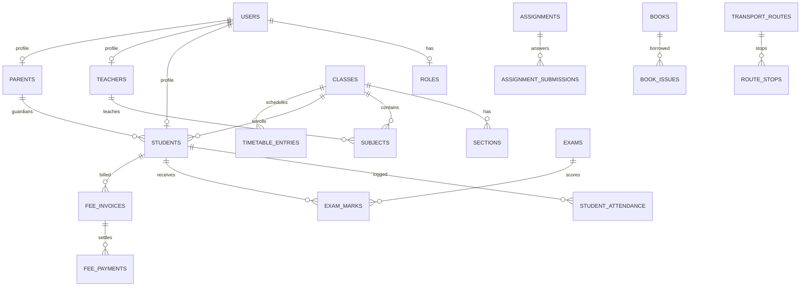

# EduPulse — Enterprise School Management System (ERP)

A modern, production-ready, full-stack School Management System built with **FastAPI**, **PostgreSQL**, and **React (Vite + Tailwind CSS)**.

---

## 🌟 Key Modules & Features

### 1. 🛡️ Authentication & RBAC
- **JWT Authentication** with password hashing via **Passlib / Bcrypt**.
- **8 Distinct Roles**: `Super Admin`, `School Admin`, `Principal`, `Teacher`, `Accountant`, `Librarian`, `Parent`, `Student`.
- **Role-Aware Dashboards & Navigation**: Dynamic access controls and tailored views per role.

### 2. 👥 People & Academic Core
- **Students & Parents**: Admissions, roll numbers, guardian relationships, emergency contacts, medical notes.
- **Teachers & Staff**: Designations, qualifications, departments, salary details, joining dates.
- **Academic Hierarchy**: Academic Sessions, Classes, Sections, and Subjects with teacher allocations.

### 3. ⏰ Timetable & Period Management
- Configurable periods (normal class vs. break).
- Weekly class and teacher schedules with **automated conflict detection** (prevents double-booking teachers, classes, or rooms).

### 4. 📋 Live Attendance Roll Call
- Daily Student Attendance roll call with bulk marking (Present, Absent, Late, Half Day, Excused).
- Teacher Attendance check-in/out.
- Comprehensive monthly & yearly attendance reports with visual percentage bars.

### 5. 🎯 Exams, Grading & Report Cards
- Exam schedules (Monthly, Mid-Term, Final, Quiz, Assignment).
- Gradebook roll call with real-time mark range validation ($0 \le \text{marks} \le \text{total\_marks}$).
- **Automated Grading Algorithm**: Computes Total, Obtained, Percentage, Letter Grade ($A+, A, B, C, D, F$), GPA, and Rank.
- **Printable Student Report Cards**: Formal report card layout with school header, subject marks table, and official seal.

### 6. 💳 Complete Fee Management
- Dynamic Fee Structures by class and fee type.
- Single & Bulk Invoicing with automated invoice numbering (`INV-YYYY-XXXX`).
- Multi-channel payments (Cash, Bank Transfer, Card, Cheque, Online).
- Automatic invoice status updates (`Pending`, `Partial`, `Paid`, `Overdue`).
- Late fee fine calculations, discretionary discounts, and **Printable Payment Receipts** (`REC-YYYY-XXXX`).

### 7. 📚 Assignments & Homework
- Teachers publish homework with attachments, max scores, and due dates.
- Students submit solutions and files online.
- Teachers review submissions, award scores, and deliver written feedback.

### 8. 📖 Library Management
- Book catalog with category, ISBN, author, and rack tracking.
- Live available copy inventory tracking.
- Book issuance and return workflow with automatic late fine calculation.

### 9. 🚌 Transport & Fleet Management
- Vehicle fleet and driver contact records.
- Transport routes with pickup/drop stops and individual stop timings.
- Student bus pass allocations per academic session.

### 10. 📅 School Calendar & Events
- Institutional calendar with color-coded categories (Exams, Holidays, PTM, Sports Gala, Trips).
- Audience targeting (All, Students, Teachers, Parents).

### 11. 📢 Notice Board & User Notifications
- Official announcements with category tags (Emergency, Exam, Fee, Holiday).
- Pinned priority notices and topbar notification drawer.

### 12. 📊 Centralized Reports Hub
- Multi-tab report generator: Student Census, Attendance Summaries, Fee Collections, Exam Results, Library Usage, and Transport Allocations.
- **CSV Data Export** and **Clean Print Sheets** for all reports.

---

## 🚀 Quickstart Guide

### Prerequisites
- Python 3.10+
- Node.js 18+ & npm
- PostgreSQL 14+

---

### 1. Database Setup
Create a PostgreSQL database:
```sql
CREATE DATABASE school_db;
```

---

### 2. Backend Installation & Run
```powershell
# Navigate to backend
cd "backend"

# Install dependencies
pip install -r requirements.txt

# Run database migrations
alembic upgrade head

# Run backend test suite (28 automated tests)
pytest -v

# Start FastAPI dev server
uvicorn app.main:app --reload --host 0.0.0.0 --port 8000
```
API Documentation will be available at: **http://localhost:8000/docs**

---

### 3. Frontend Installation & Run
```powershell
# Navigate to frontend
cd "frontend"

# Install dependencies
npm install

# Build check
npm run build

# Start Vite dev server
npm run dev
```
Frontend Web Application will be available at: **http://localhost:5173**

---

## 🔑 Default Seed Accounts & Credentials

| Role | Username | Password | Notes |
| :--- | :--- | :--- | :--- |
| **Super Admin** | `superadmin` | `password123` | Full system access |
| **School Admin**| `schooladmin`| `password123` | Operational management |
| **Principal**   | `principal`  | `password123` | Academic & institutional oversight |
| **Teacher**     | `teacher`    | `password123` | Class schedule, grading & assignments |
| **Accountant**  | `accountant` | `password123` | Fee collections & invoicing |
| **Librarian**   | `librarian`  | `password123` | Book cataloging & issues |
| **Parent**      | `parent`     | `password123` | Scoped to their children |
| **Student**     | `student`    | `password123` | Personal timetable, homework & grades |

---

## 🏗️ Architecture & Database Entity Schema



---

## 🧪 Automated Testing

The backend includes a comprehensive pytest suite covering all 12 modules:
- Authentication & JWT permissions
- Academic core CRUD & relationships
- Timetable conflict detection
- Daily Attendance & aggregation
- Exam creation, marks validation & report cards
- Fee structures, bulk invoicing, partial payments, receipts, discounts & fines
- Assignments, submissions & grading
- Library book issues, available copy decrement/increment & late fines
- Transport routes, vehicles & student pass allocation
- Calendar events & announcements

To run all tests:
```powershell
cd backend
pytest -v
```
**Current Test Status: 28 passed in 18.32s (100% pass rate)**
